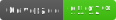

  <p align="center">
    
    
    
    <a href="https://github.com/search?q=dangoslen+dependabot-changelog-helper+path:.github/workflows+language:YAML&type=Code"></a>
</p>

## Dependabot Changelog Helper

Automatically update your changelog on Dependabot pull requests! No more manually updating a changelog for dependency upgrades. Just fast and easy dependency upgrades.

### We all love dependency management tools...

But it can feel overwhelming and require additional work to update things like versions and changelogs.

Built around the [KeepAChangelog](https://keepachangelog.com/) format, this action looks for upgraded dependencies on a Dependabot pull request and adds them to your changelog. 

- Handles adding the appropriate `### Dependencies` and/or `## [<version>]` sections if needed (including `UNRELEASED`)
- Supports multi-package updates in a single pull request
- Updates the entry for a dependency if the dependency had been upgraded previously in the same version
- Includes link(s) to associated pull requests that upgraded the dependency
- Supports Dependabot and Renovate dependency updates

### Usage

#### Example Workflow

The workflow example below will get you up-and-running for your Dependabot pull requests. This configuration will add entries
to an `UNRELEASED` section of your `./CHANGELOG.md` and will run on any pull request labeled with `dependencies` (which is added by Dependabot as a default)

```yaml
name: 'pull-request'
on:
  pull_request:
    types:
      - opened
      - synchronize
      - reopened
      - ready_for_review
      - labeled
      - unlabeled

jobs:
  changelog:
    runs-on: ubuntu-latest
    steps:
      - uses: actions/checkout@v3
        with:
          # Depending on your needs, you can use a token that will re-trigger workflows
          # See https://github.com/stefanzweifel/git-auto-commit-action#commits-of-this-action-do-not-trigger-new-workflow-runs
          token: ${{ secrets.GITHUB_TOKEN }}

      - uses: dangoslen/dependabot-changelog-helper@v3
        with:
          activationLabels: dependencies
          changelogPath: './CHANGELOG.md'
          dependencyTool: dependabot
          
      # This step is required for committing the changes to your branch. 
      # See https://github.com/stefanzweifel/git-auto-commit-action#commits-of-this-action-do-not-trigger-new-workflow-runs 
      - uses: stefanzweifel/git-auto-commit-action@v4
        with:
          commit_message: "Updated Changelog"
```

### Entry Format

The format for an entry is as follows

```
- <entryPrefix> <package> from <oldVersion> to <newVersion> (#pr-number[, #pr-number])`
```

The `<entryPrefix>` can be controlled via the [entry-prefix input](#entryprefix).

### Inputs / Properties

Below are the properties you can use for the Dependabot Changelog Helper.

#### `version`

| Default      | Description                                                        |
| ------------ | ------------------------------------------------------------------ |
| `UNRELEASED` | The version to find in the changelog to add Dependabot entries to. |

If the `version` is not found then an unreleased version - matching the pattern `/^## [(unreleased|Unreleased|UNRELEASED)]` - is used.

Many changelogs default to keeping an unreleased version at the top of the changelog.
This is a way to incrementally build a version over time and only release a version once the right changes have been accounted for.

Provide a version with forward slashes to use a regex to match the version section. For example: `/^## \\[\d+\.\d+\.\d+\\] - Unreleased/` will match `## [1.2.3] - Unreleased` but not `## [1.3.0] - 2025-03-25`.

#### `changeLogPath`

| Default          | Description                                                  |
| ---------------- | ------------------------------------------------------------ |
| `./CHANGELOG.md` | The path to the changelog file to add Dependabot entries to. |

| Default  | Description                                                                                                  |
| -------- | ------------------------------------------------------------------------------------------------------------ |
| `dependabot`     | DEPRECATED! Please use the `activationLabels` input below. The label to indicate that the action should run. |

If both `activationLabel` and `activationLabels` inputs are provided, _all_ labels between the two inputs are required for the action to run.
 
#### `activationLabels`

| Default      | Description                                       |
| ------------ | ------------------------------------------------- |
| `dependabot` | The labels to indicate that the action should run. All of the labels must be present in order for the action to run. |

#### `entryPrefix`

| Default      | Description                                                                                       |
| ------------ | ------------------------------------------------------------------------------------------------- |
| `Bump`       | The starting word of a dependency bump entry line. Currently, it only supports single-word prefixes. |

If a previous entry was written with a different entry (`Bump` vs. `Bumps`), the entry will still get updated for updates within the same version as long as the prefix is a single word. 

#### `sectionHeader`

| Default        | Description                                       |
| -------------- | ------------------------------------------------- |
| `Dependencies` | The name of section to add Dependabot entries to. |

If `sectionHeader` is not provided, the action will look for a section header matching the pattern `/^### [(Dependencies|DEPENDENCIES)]`.

#### `sort`

| Default | Description                                               |
| --------| --------------------------------------------------------- |
| `none`  | Whether to apply any sorting to added entries. Current values include `none` (no sorting, append-only) and `alpha` (sorts entries based on the alphabetical ordering of the package name) |

#### `dependencyTool`

| Default      | Description                                                        |
| ------------| ------------------------------------------------------------------ |
| `dependabot` | The dependency management tool being used. Supported values are `dependabot` and `renovate`. This determines how dependency information is extracted from pull requests. |

## Alternatives

This action aims to be intentionally minimal in its solution, only updating the changelog with dependencies and with as little change to the changelog as possible. 

Other actions have a bit broader scope and/or solve the problem of keeping a changelog up-to-date in a slightly different way. If this action doesn't meet your needs, consider looking at one of the alternatives. If none match your needs, consider [opening an issue for discussion](https://github.com/dangoslen/dependabot-changelog-helper/issues/new)!

* https://github.com/marketplace/actions/dependabot-changelog-writer
