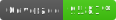

  <p align="center">
    
    
    
</p>

## Dependabot Changelog Helper

This action helps you easily auto-update your changelog!

### We all love Dependabot...

But it can feel overwhelming and require additional work to update things like versions and changelogs.

Built around the [KeepAChangelog](https://keepachangelog.com/) format, this action looks for an entry line for an updated package and either:

- Adds an entry if not found (including adding the `### Dependencies` and `## [<version>]` sections!)
- Updates the entry if one has been found within the same version. 
  - This includes update the upgraded version and the associated pull request numbers

### Entry Format

The format for an entry is as follows

```
- <entryPrefix> <package> from <oldVersion> to <newVersion> (#pr-number[, #pr-number])`
```

The `<entryPrefix>` can be controlled via the [entry-prefix input](#entryprefix).

### Usage

#### Example Workflow

```yaml
name: 'pull-request'
on:
  pull_request:
    types:
      - opened
      - synchronize
      - reopened
      - ready_for_review
      - labeled
      - unlabeled

jobs:
  changelog:
    runs-on: ubuntu-latest
    steps:
      - uses: actions/checkout@v3
        with:
          # Depending on your needs, you can use a token that will re-trigger workflows
          # See https://github.com/stefanzweifel/git-auto-commit-action#commits-of-this-action-do-not-trigger-new-workflow-runs
          token: ${{ secrets.GITHUB_TOKEN }}

      - uses: dangoslen/dependabot-changelog-helper@v3
        with:
          version: ${{ needs.setup.outputs.version }}
          activationLabel: 'dependabot'
          changelogPath: './CHANGELOG.md'

      # This step is required for committing the changes to your branch. 
      # See https://github.com/stefanzweifel/git-auto-commit-action#commits-of-this-action-do-not-trigger-new-workflow-runs 
      - uses: stefanzweifel/git-auto-commit-action@v4
        with:
          commit_message: "Updated Changelog"
```

### Inputs / Properties

Below are the properties you can use for the Dependabot Changelog Helper.

#### `version`

| Default      | Description                                                        |
| ------------ | ------------------------------------------------------------------ |
| `UNRELEASED` | The version to find in the changelog to add Dependabot entries to. |

If the `version` is not found then an unreleased version - matching the pattern `/^## [(unreleased|Unreleased|UNRELEASED)]` - is used.

Many changelogs default to keeping an released version at the top of the changelog.
This is a way to incrementally build a version over time and only release a version once the right changes have been accounted for.

> **Warning**
> For the action to work you must have either set a `version` _or_ have an unreleased version in your changelog.

#### `changeLogPath`

| Default          | Description                                                  |
| ---------------- | ------------------------------------------------------------ |
| `./CHANGELOG.md` | The path to the changelog file to add Dependabot entries to. |

#### `activationLabel`

| Default      | Description                                       |
| ------------ | ------------------------------------------------- |
| `dependabot` | The label to indicate that the action should run. |

#### `entryPrefix`

| Default      | Description                                                                                       |
| ------------ | ------------------------------------------------------------------------------------------------- |
| `Bump`       | The starting word of a dependency bump entry line. Currently only supports single world prefixes. |

If a previous entry was written with a different entry (`Bump` vs `Bumps`), the entry will still get updated for updates within the same version as long as the prefix is a single word. 

#### `sectionHeader`

| Default        | Description                                       |
| -------------- | ------------------------------------------------- |
| `Dependencies` | The name of section to add Dependabot entries to. |

If `sectionHeader` is not provided, the action will look for a section header matching the pattern `/^### [(Dependencies|DEPENDENCIES)]`.
